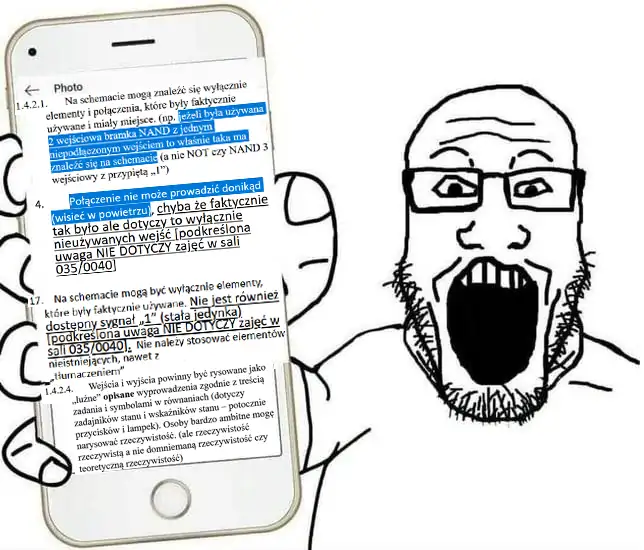
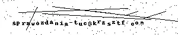

# polsl-sprawozdania-tuc

*Zobacz też: [polsl-sprawozdania-fizyka](https://github.com/krzsztfwtk/polsl-sprawozdania-fizyka)*

W tym repozytorium znajdziesz przykładowe sprawozdania👩‍🔬 z ćwiczeń, realizowanych na laboratoriach teorii układów cyfrowych🔢 na Informatyce💻 - Semestr 3 na Politechnice Śląskiej🎓. Dodaję tu tylko sprawdzone i ocenione pozytywnie sprawozdania✅.

## Ćwiczenia 🔌

1. [Kombinacyjne automaty cyfrowe (Układy sterowania, konwertery kodów, układy z zależnościami czasowymi)](./sources/kombinacyjne_automaty_cyfrowe.pdf) ⛽
2. `Konwertery kodów`
3. [Elementarne automaty sekwencyjne](./sources/elementarne_automaty_sekwencyjne.pdf) ⚙️
4. [Asynchroniczne automaty sekwencyjne](./sources/asynchroniczne_automaty_sekwencyjne.pdf) 🔄
5. [Synchroniczne automaty sekwencyjne](./sources/synchroniczne_automaty_sekwencyjne.pdf) ⏱️
6. [Wybrane układy arytmetyczne](./sources/wybrane_uklady_arytmetyczne.pdf) ➕
7. [Dynamika układów cyfrowych](./sources/dynamika_ukladow_cyfrowych.pdf) ⚡
8. `Automaty cyfrowe z zależnościami czasowymi`
9. [Rejestry i liczniki](./sources/rejestry_i_liczniki.pdf) 🧮
10. `Liczniki`
11. [Komutatory (Multipleksery i demultipleksery)](./sources/komutatory.pdf) 🔀
12. [Elementy komputerowo wspomaganego projektowania automatów cyfrowych](./sources/elementy_komputerowo_wspomaganego_projektowania_automatow_cyfrowych.pdf) 🖨️
13. `Elementy komputerowo wspomaganego projektowania automatów cyfrowych (część 2)`
14. [Mikroprogramowane sekwencyjne automaty cyfrowe](./sources/mikroprogramowalne_sekwencyjne_automaty_cyfrowe.pdf) 📚

### Uwagi

- Tematyka wszystkich ćwiczeń jest szczegółowo omówiona w skrypcie: Małysiak, H. (Red.). (2003). _Teoria Automatów Cyfrowych - Laboratorium_ (wydanie V). Gliwice: Wydawnictwo Politechniki Śląskiej. [Skrypt jest dostępny w bibliotece cyfrowej Politechniki Śląskiej](https://delibra.bg.polsl.pl/dlibra/publication/79830/edition/70831).
- `Nieaktywne` są te tematy ćwiczeń, które są poruszone w oddzielnych rozdziałach w wyżej wymienionym skrypcie, ale na laboratorium zostały zrealizowane w ramach innego ćwiczenia. ⚠️
- Sposób rysowania schematów dla ćwiczeń *1, 3, 11, 12, 14* różni się od tego dla ćwiczeń *4, 5, 6, 7, 9*. Sprawozdania te były przesyłane do dwóch różnych prowadzących. Podczas laboratoriów używane były bramki typu TTL, co w praktyce oznaczało osiąganie stanu wysokiego przez pozostawienie niepodłączonego wejścia na bramce. Pierwszy prowadzący (dla ćwiczeń *1, 3, 11, 12, 14*) powoływał się na wytyczne do sporządzania sprawozdań [dostępne na stronie **ZMiTAC**](https://db.zmitac.aei.polsl.pl/GD/sprawozdania.html) *Na schemacie mogą znaleźć się wyłącznie elementy i połączenia, które były faktycznie używane i miały miejsce. (np. jeżeli była używana 2 wejściowa bramka NAND z jednym niepodłączonym wejściem to właśnie taka ma znaleźć się na schemacie (a nie NOT czy NAND z przypiętą „1”)*. Drugi prowadzący (dla ćwiczeń *4, 5, 6, 7, 9*) uznał, że bramki TTL są przestarzałe i należy rysować schematy bez niepodłączonych wejść, gdyż rysowanie schematów z niepodłączonymi wejściami jest nieprofesjonalne.
- Dziękuję za zainterowanie, którym cieszy się repozytorium. Jeśli uznasz je za przydatne, zachęcam do zostawienia gwiazdki.
- Proszę nie pisać do mnie z próśbami o `bezinteresowną` pomoc w rozwiązywaniu konkretnych zadań. Jestem zaangażowany we własne projekty i nie dysponuję wystarczającą ilością wolnego czasu, aby `bezinteresownie` pomagać każdemu, kto do mnie napisze w rozwiązywaniu zadań.
- Najlepiej wykonane są sprawozdania do tematów 11, 5, 7, 9
- Najgorzej wykonane jest sprawozdanie do tematu 12

> Rysunek przedstawia studenta 3. semestru, który pierwszy raz czyta wytyczne do sporządzania sprawozdań (na telefonie wyświetlane są zrzuty ekranu, ponieważ dostęp do strony ZMiTAC wymaga specjalnej konfiguracji).

## Jak Korzystać z Repozytorium ❓

Każdy plik PDF związany z konkretnym ćwiczeniem możesz pobrać, klikając na odpowiedni link powyżej.

## Kontakt 📬

Jeśli masz pytania, sugestie lub widzisz błąd, nie wahaj się utworzyć 'Issue' na GitHubie.
Jeżeli potrzebujesz dedykowanej pomocy napisz tutaj:

## Licencja i zasady użytkowania

Celem udostępnienia tych materiałów jest wspieranie zdobywania wiedzy, a nie zachęcanie do nieuczciwości na studiach.

### Możesz

- Przeglądać materiały i korzystać z nich w celach edukacyjnych.
- Wykorzystywać materiały jako inspirację do własnych projektów lub nauki.

### Nie możesz

- Kopiować i przedstawiać tych materiałów jako własne.
- Rozpowszechniać materiałów bez odpowiedniego uznania autorstwa.
- Składać tych treści jako własne prace w ramach studiów lub innych obowiązków akademickich.
