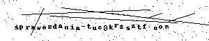

# polsl-sprawozdania-tuc

W tym repozytorium znajdziesz przykładowe sprawozdania👩‍🔬 z ćwiczeń, realizowanych na laboratoriach teorii układów cyfrowych🔢 na Informatyce💻 - Semestr 3 na Politechnice Śląskiej🎓. Dodaję tu tylko sprawdzone i ocenione pozytywnie sprawozdania✅.

## Ćwiczenia 🔌

1. [Kombinacyjne automaty cyfrowe (Układy sterowania, konwertery kodów, układy z zależnościami czasowymi)](./sources/kombinacyjne_automaty_cyfrowe.pdf) ⛽
2. `Konwertery kodów`
3. [Elementarne automaty sekwencyjne](./sources/elementarne_automaty_sekwencyjne.pdf) ⚙️
4. [Asynchroniczne automaty sekwencyjne](./sources/asynchroniczne_automaty_sekwencyjne.pdf) 🔄
5. [Synchroniczne automaty sekwencyjne](./sources/synchroniczne_automaty_sekwencyjne.pdf) ⏱️
6. [Wybrane układy arytmetyczne](./sources/wybrane_uklady_arytmetyczne.pdf) ➕
7. [Dynamika układów cyfrowych](./sources/dynamika_ukladow_cyfrowych.pdf) ⚡
8. `Automaty cyfrowe z zależnościami czasowymi`
9. [Rejestry i liczniki](./sources/rejestry_i_liczniki.pdf) 🧮
10. `Liczniki`
11. [Komutatory (Multipleksery i demultipleksery)](./sources/komutatory.pdf) 🔀
12. [Elementy komputerowo wspomaganego projektowania automatów cyfrowych](./sources/elementy_komputerowo_wspomaganego_projektowania_automatow_cyfrowych.pdf) 🖨️
13. `Elementy komputerowo wspomaganego projektowania automatów cyfrowych (część 2)`
14. [Mikroprogramowane sekwencyjne automaty cyfrowe](./sources/mikroprogramowalne_sekwencyjne_automaty_cyfrowe.pdf) 📚

### Uwaga

**Uwaga:** `Nieaktywne` są te tematy ćwiczeń, które są poruszone w oddzielnych rozdziałach w niżej wymienionym skrypcie, ale na laboratorium zostały zrealizowane w ramach innego ćwiczenia. ⚠️

Tematyka wszystkich ćwiczeń jest szczegółowo omówiona w skrypcie: Małysiak, H. (Red.). (2003). _Teoria Automatów Cyfrowych - Laboratorium_ (wydanie V). Gliwice: Wydawnictwo Politechniki Śląskiej. [Skrypt jest dostępny w bibliotece cyfrowej Politechniki Śląskiej](https://delibra.bg.polsl.pl/dlibra/publication/79830/edition/70831).

## Jak Korzystać z Repozytorium ❓

Każdy plik PDF związany z konkretnym ćwiczeniem możesz pobrać, klikając na odpowiedni link powyżej.

## Kontakt 📬

Jeśli masz pytania, sugestie lub widzisz błąd, nie wahaj się utworzyć 'Issue' na GitHubie.
Jeżeli potrzebujesz dedykowanej pomocy, dokumentów w Wordzie lub dodatkowych narzędzi np. do rysowania wykresów czasowch, 💵 napisz tutaj 💲:

